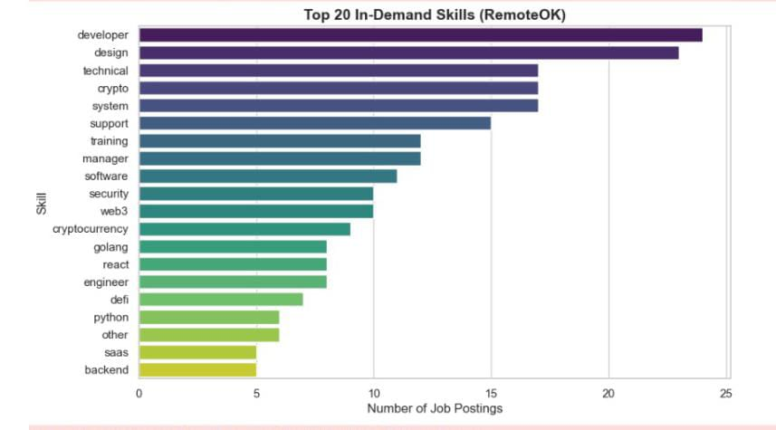
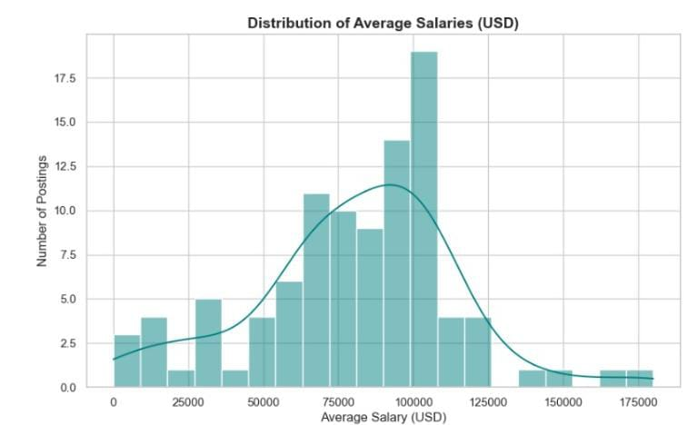

# Remote Job Market Analysis (Web Scraping + EDA)


---

##  Project Overview
This project demonstrates **end-to-end web scraping, data cleaning, and analysis** of remote job postings.  
We collected live job postings from **[RemoteOK](https://remoteok.com/)** using Selenium, structured the dataset, and performed **Exploratory Data Analysis (EDA)** to extract actionable insights.


---

##  Objectives
- Scrape **job postings** (title, company, skills, salary, location, posting date).  
- Clean and normalize messy text fields (skills, salaries, locations).  
- Flatten skills into analyzable format.  
- Perform **EDA with visualizations**:
  - Most in-demand skills  
  - Top hiring companies  
  - Job location breakdown  
  - Salary distribution  
  - Job postings trend over time  

---


## 📂 Project Structure

┣ 📜 README.md

┣ 📜 requirements.txt

┣ 📂 notebooks
┃ ┗ 📓 web-scrap.ipynb

┣ 📂 data
┃ ┗ remoteok_jobs.csv

┗ 📂 images
  ┣ top_skills.png
  ┣ salary_distribution.png
  ┗ jobs_trend.png

  
---

## 📊 Key Insights
### 🔹 Top 20 Skills in Demand


> Python, AWS, and SQL dominate the remote data science job market.

### 🔹 Salary Distribution


> Most jobs fall between **$60k–120k**, with some high-paying roles exceeding $150k.

### 🔹 Job Postings Over Time


> Remote job postings show consistent demand, peaking in the last month.

---
 

##  Setup & Installation

1. **Clone the repository**
   ```bash
   git clone https://github.com/<kanyi-Gabriel>/job-market-wbscraper.git
   
2. Create a virtual environment
    ```bash

   conda create -- name environment_name
   conda activate environment_name
   pip install -r requirements.txt
    
3. To add the environment to jupyter notebook
    ```bash
    conda install -c anaconda ipykernel
    python -m ipykernel install --user--name = environment_name

